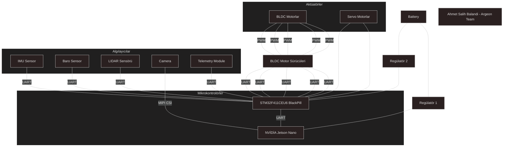

```mermaid
---
config:
  theme: neo-dark
---
flowchart TD
 subgraph s1["Mikrokontrolörler"]
        Jetson_Nano["NVİDİA Jetson Nano"]
        STM["STM32F411CEU6 BlackPill"]
  end
 subgraph s2["Algılayıcılar"]
        IMU["IMU Sensor"]
        Baro["Baro Sensor"]
        LIDAR["LIDAR Sensörü"]
        Camera["Camera"]
        Telemetry["Telemetry Module"]
  end
 subgraph s3["Aktüatörler"]
        Motors["BLDC Motorlar"]
        sMotors["Servo Motorlar"]
  end
    Motors -- PWM --- Drivers["BLDC Motor Sürücüleri"] & Drivers & Drivers & Drivers & Drivers
    Drivers -- UART --- STM & STM & STM & STM & STM
    LIDAR -- UART --- STM
    IMU -- UART --- STM
    Baro -- UART --- STM
    Telemetry -- UART --- STM
    Camera -- MIPI CSI --- Jetson_Nano
    STM -- UART --- Jetson_Nano
    Battery["Battery"] --- Regulator1["Regülatör 1"] & Regulator2["Regülatör 2"]
    Regulator1 --- Jetson_Nano
    Regulator2 --- STM
    sMotors --- STM & STM
classDef footer fill:none,stroke:none,color:#000, font-style:italic;
footer["Ahmet Salih Balandi - Argeon Team"]
```
