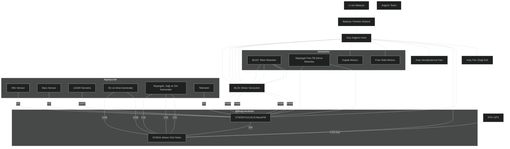

```mermaid
---
config:
  theme: dark
  themeVariables:
    background: "#ffffff"
---
flowchart TD
 subgraph s1["Mikrokontrolörler"]
        Jetson_Nano["NVIDIA Jetson Orin Nano"]
        STM["STM32F411CEU6 BlackPill"]
  end
 subgraph s2["Algılayıcılar"]
        IMU["IMU Sensor"]
        Baro["Baro Sensor"]
        LIDAR["LIDAR Sensörü"]
        Camera1["Ön ve Arka Kameralar"]
	Camera2["Nişangah, Sağ ve Sol Kameralar"]
        Telemetry["Telemetri"]
  end
 subgraph s3["Aktüatörler"]
        Motors["BLDC Teker Motorları"]
        sMotors["Nişangah Pan-Tilt Servo Motorları"]
	fMotor["Fren Diski Motoru"]
	kMotor["Kapak Motoru"]
  end
    Motors --- Drivers["BLDC Motor Sürücüleri"] & Drivers & Drivers & Drivers
    Battery["Li-ion Batarya"] --- BMS["Batarya Yönetim Sistemi"]
    BMS["Batarya Yönetim Sistemi"] --- Distributor["Güç Dağıtım Kartı"]
    Distributor & Distributor & Distributor & Distributor & Distributor --- Drivers
    Distributor --- kMotor & fMotor
    Distributor --- Havalandırma["Araç Havalandırma Fanı"]
    Drivers -- PWM --- STM & STM & STM & STM
    LIDAR -- UART --- STM
    IMU -- I2C --- STM
    Baro -- I2C --- STM
    Telemetry -- I2C --- STM
    GPS["RTK GPS"] -- CAN bus --- Jetson_Nano
    Camera1 & Camera1 -- USB --- Jetson_Nano
    Camera2 & Camera2 & Camera2 -- CSI --- Jetson_Nano
    STM -- SPI --- Jetson_Nano
    Distributor --- Jetson_Nano
    Distributor --- STM
    Distributor --- Far["Araç Farı (Sağ-Sol)"]
    sMotors --- STM & STM
classDef footer fill:none,stroke:none,color:#000, font-style:italic;
footer["Argeon Team"]
```
